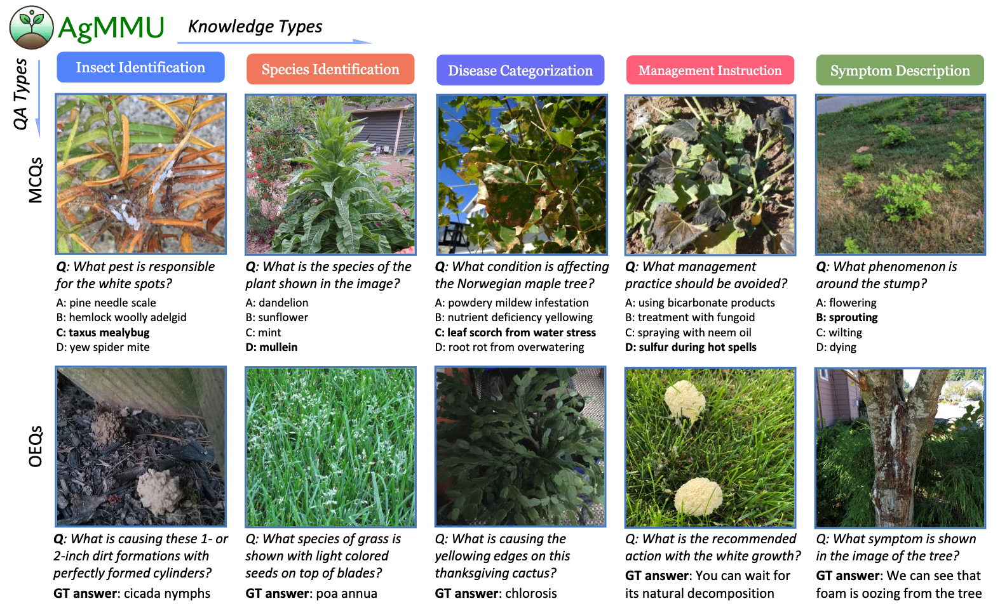
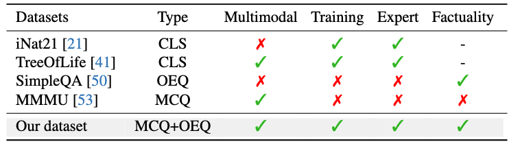

<h1>
  
  <span class="mmmu" style="vertical-align: middle">AgMMU: A Comprehensive Agricultural Multimodal Understanding and Reasoning Benchmark</span>
</h1>

<div class="is-size-5 publication-authors">
  <span class="author-block">Aruna Gauba*<sup>1</sup>,</span>
  <span class="author-block">Irene Pi*<sup>2</sup>,</span>
  <span class="author-block">
    <a href="https://yunzeman.github.io/" style="text-decoration:color: inherit;" target="_blank">Yunze Man†<sup>3</sup></a>,
  </span>
  <span class="author-block">
    <a href="https://ziqipang.github.io/" style="text-decoration:color: inherit;" target="_blank">Ziqi Pang†<sup>3</sup></a>,
  </span>
  <span class="author-block">
    <a href="https://vikram.cs.illinois.edu/" style="text-decornone; color: inherit;">Vikram S. Adve<sup>3</sup></a>,
  </span>
  <span class="author-block">
    <a href="https://yxw.cs.illinois.edu/" style="text-decornone; color: inherit;">Yu-Xiong Wang<sup>3</sup></a>
  </span>
</div>


$^1$ Rice University, $^2$ Carnegie Mellon University, $^3$ University of Illinois at Urbana-Champaign

$^*$ Equal contribution, $^{†}$ Project Lead

[[`Project Page`](https://agmmu.github.io/)][[`Paper`](https://arxiv.org/abs/2504.01611)][[`Huggingface Dataset`](https://huggingface.co/datasets/AgMMU/AgMMU_v1)][[`AIFARM Demo from UIUC`](https://uiuc.chat/cropwizard-1.5)]


## 1. Introduction to AgMMU

AgMMU is a multimodal knowledge-intensive dataset with the expertise of agricultural domain data. Vision-language models (VLMs) have to observe the details of images and provide factually precise answers. Enabled by real-world user-expert conversations, AgMMU features 3390 open-ended questions for factual questions (OEQs), 5793 multiple-choice evaluation like conventional vision-language benchmarks (MCQs), and an agricultural knowledge base with 205,399 pieces of facts for model fine-tuning. We hope AgMMU can benefit both knowledge-intensive VLMs and the social good of agriculture.



AgMMU is created to develop factually accurate VLMs following the principle of [SimeQA](https://openai.com/index/introducing-simpleqa/). For the research community, AgMMU uniquely features both close and open-ended questions, and a large-scale agricultural knowledge base for fine-tuning.



## 2. Data Preparation

Our dataset is hosted on Hugging Face. You can download the dataset from [here](https://huggingface.co/datasets/AgMMU/AgMMU_v1). It contains the following parts:

- Evaluation set: Download the `agmmu_hf1.json` for evaluating models on OEQs and MCQs.
- (Optional) Knowledge base: Download our knowledge base for fine-tuning models.
- Images: Download the `images_part_x.tar.gz`, then extracting them to `images/`.

## 3. Inference and Evaluation

Adter downloading the dataset, you can evaluate your model on the AgMMU dataset by following the instructions below.

### 3.1 Overview
The `scoring_eval_pipeline/evaluation/eval.py` script evaluates and scores model outputs on the AgMMU dataset. It supports multiple-choice (MCQ) and open-ended question (OEQ) formats and expects outputs to follow a specific JSON structure.

### 3.2 Inference

To run inference of an VLM, an example command is as follows:

```bash
   python evaluate.py \
     --data_path /path/to/data.json \
     --output_path /path/to/output.json \
     --image_dir /path/to/image_directory/
```

- `--data_path`: Path to the JSON file.
- `--output_path`: Path to save the evaluation results.
- `--image_dir`: Directory containing input images named as `<faq-id>-1.jpg`.

If you want to run customized VLMs, follow the instructions below:
- Update the `run_llms()` function in `evaluate.py` to call your own model.
- Edit the `llm_map` passed into `eval_data()` in `main()`: `llm_map={"your-model-name-oeq": {}, "your-model-name-mcq": {}}`
- Note that model names must end with `-oeq` for open-ended or `-mcq` for multiple choice.

### 3.3 Format for Evaluation

To use our evaluation script, please format your output by the following format:

- `agmmu_question`: The original question object.
- `qtype`: Type of the question (e.g., `insect/pest`).
- `llm_answers`: A dictionary mapping LLM names to their answers.

We provide an example format below:

```json
[
  {
    "agmmu_question": {
      "question": "What insect is indicated by the image?",
      "options": [
        "roseslug sawflies",
        "japanese beetle",
        "spotted lanternfly nymph",
        "gypsy moth larva"
      ],
      "answer": "roseslug sawflies",
      "question_background": "The following question has this background information:\nbackground info: plant is in a balcony container, has been sprayed with Neem oil with no effect, plant is Eden White Climber\nspecies: rose\nlocation: Montgomery County,Maryland\ntime: 2023-07-19 02:00:44\n",
      "letter": "A."
    },
    "qtype": "insect/pest",
    "llm_answers": {
      "gpt-4o-oeq": {
        "answer": "Aphids"
      },
      "gpt-4o-mcq": {
        "answer": "C"
      }
    }
  }
]
```

Most importantly, the `answer` key inside each model entry should contain the model's response.

### 3.4 Evaluation and Metric Calculation

The `scoring_eval_pipeline/scoring/score.py` script evaluates and scores model outputs on the AgMMU dataset.

To run the scoring script, use the following command:

```bash
python score.py \
  --input_file input_file.json \
  --output_file output_file.json
```

The `--output_file` will contain:
- Per-question scores
- A printed summary with harmonic means for overall evaluation metrics

### 3.5 Installation

We only use the most common libraries in python and deep learning. If you have any issues, please remember to install the dependencies of:
```bash
pip install transformers torch openai tqdm Pillow requests python-dotenv beautifulsoup4
```
## 4. Citations

If you find our dataset useful, please cite our paper:

```
@article{gauba2025agmmu,
  title={AgMMU: A Comprehensive Agricultural Multimodal Understanding and Reasoning Benchmark},
  author={Gauba, Aruna and Pi, Irene and Man, Yunze and Pang, Ziqi and Adve, Vikram S and Wang, Yu-Xiong},
  journal={arXiv preprint arXiv:},
  year={2025}
}
```

## 5. Acknowledgements

We appreciate the help from [AskExtension](https://ask2.extension.org/) for providing the raw images and user-expert conversations for building AgMMU.
